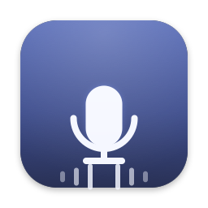

<div align="center">



# VoiceType

### Parlez partout, dans votre langue — un texte propre instantanément, entièrement sur votre appareil.

Une application de dictée vocale pour macOS rapide, privée et open source. Maintenez
une touche enfoncée, parlez — en français, English, 中文, Español, 日本語 ou dans plus
de 30 autres langues — et vos mots arrivent sous forme de texte propre et ponctué dans
n'importe quelle application. Votre audio ne quitte jamais votre Mac : tout s'exécute
sur l'appareil.

[](https://github.com/michael-L-i/VoiceType/releases/latest/download/VoiceType.dmg)

[](https://github.com/michael-L-i/VoiceType/releases/latest)
&nbsp;[](https://www.apple.com/macos/)
&nbsp;[](https://swift.org)
&nbsp;[](#privacy)
&nbsp;[](#languages)
&nbsp;[](../../LICENSE)

[English](../../README.md) ·
[简体中文](./README.zh-Hans.md) ·
[Deutsch](./README.de.md) ·
[Español](./README.es.md) ·
**Français** ·
[Italiano](./README.it.md) ·
[日本語](./README.ja.md) ·
[한국어](./README.ko.md) ·
[Nederlands](./README.nl.md) ·
[Polski](./README.pl.md) ·
[Português](./README.pt-BR.md) ·
[Русский](./README.ru.md) ·
[Svenska](./README.sv.md) ·
[Türkçe](./README.tr.md) ·
[Українська](./README.uk.md) ·
[Tiếng Việt](./README.vi.md)

_Cette traduction est maintenue au mieux ; le README anglais est la version de référence. Les corrections sont bienvenues par [pull request](../../CONTRIBUTING.md)._

</div>

---

> **Notre cap :** parlez partout, obtenez immédiatement un texte propre, sans que votre audio ne quitte votre Mac.

## Pourquoi VoiceType

- 🔒 **Privé par conception.** L'audio et les transcriptions restent sur votre Mac. Aucun compte, aucune télémétrie, aucun cloud : rien à désactiver.
- ⚡ **La latence est la fonctionnalité.** Swift natif et modèle vocal d'Apple sur l'appareil : nous optimisons le temps jusqu'au texte.
- 🌍 **Parle votre langue.** Dictez dans plus de 30 langues, pas seulement en anglais. Le nettoyage respecte les conventions de chaque langue (ponctuation pleine chasse en 中文, 句号 prononcé, hésitations propres à chaque langue), l'app choisit un moteur qui prend réellement votre langue en charge et son interface est disponible en 16 langues.
- 🎙️ **Appuyez pour parler partout.** Un raccourci global fonctionne dans toute app ; le texte nettoyé est inséré exactement là où se trouve le curseur.
- ✨ **Nettoyage intelligent.** Ponctuation, majuscules et suppression des hésitations, sans jamais modifier vos mots.
- 📊 **Votre voix en images.** Un tableau de bord Home apaisé suit vos mots, votre rythme et vos séries quotidiennes, avec une carte d'activité complète et un résumé d'utilisation calculé localement sur votre Mac.
- 🧩 **Moteurs interchangeables.** Le modèle Apple intégré est utilisé par défaut ; vous pouvez télécharger et activer, un à la fois, une amélioration locale optionnelle : NVIDIA Parakeet.

## Télécharger et installer

1. **[⬇ Téléchargez VoiceType.dmg](https://github.com/michael-L-i/VoiceType/releases/latest/download/VoiceType.dmg)** depuis la dernière version.
2. Ouvrez le DMG et faites glisser **VoiceType** dans votre dossier **Applications**. L'app est **signée et notariée par Apple** ; elle s'ouvre normalement par double-clic, sans contournement de Gatekeeper.
3. Accordez les trois autorisations demandées par VoiceType : **Microphone**, **Reconnaissance vocale** et **Accessibilité**. C'est prêt.

> Nécessite macOS 14 ou version ultérieure (Apple Silicon).

**Les mises à jour sont automatiques.** VoiceType vérifie les nouvelles versions en arrière-plan (et à la demande via **Rechercher les mises à jour…**) et les installe sur place avec [Sparkle](https://sparkle-project.org) ; chaque mise à jour est signée et vérifiée cryptographiquement. Aucun nouveau téléchargement n'est nécessaire. _(La mise à jour automatique fonctionne à partir de v0.1.1 ; la toute première version, v0.1.0, doit être remplacée une fois à la main.)_

## Utilisation

Maintenez **Option droite (⌥)** n'importe où et commencez à parler. Une pastille givrée affiche une forme d'onde en direct pendant l'écoute ; relâchez la touche et votre texte nettoyé est inséré dans l'app active. Ouvrez la fenêtre à tout moment pour voir votre **tableau de bord Home** — rythme, totaux, carte d'activité et lieux où vous dictez. Modifiez la touche, la langue, les moteurs et le nettoyage dans **Réglages**.

## Moteurs

Tout s'exécute sur l'appareil. Le modèle Apple est intégré à macOS et sélectionné par défaut ; vous pouvez télécharger d'autres moteurs locaux depuis la page **Modèles** de la barre latérale et passer de l'un à l'autre (un seul est actif à la fois).

| Étape | Par défaut (intégré) | Alternatives facultatives (sur l'appareil) |
| --- | --- | --- |
| **Transcription** | `Speech` d'Apple | **Parakeet TDT 0.6B V3** (NVIDIA, via [FluidAudio](https://github.com/FluidInference/FluidAudio)) · **Whisper Base** (OpenAI, via [WhisperKit](https://github.com/argmaxinc/WhisperKit)) — téléchargement à la demande |
| **Nettoyage** | Règles intégrées (instantanées, déterministes) | Apple Intelligence (`FoundationModels`, macOS 26+) — intégré à macOS, sans téléchargement |

Les modèles téléchargeables ne sont récupérés qu'une fois, à la demande (pas de cloud lors de l'inférence : votre audio reste sur le Mac) et s'exécutent avec CoreML sur le Neural Engine d'Apple. VoiceType bascule automatiquement vers un moteur disponible si votre choix ne peut pas s'exécuter et revient toujours au texte brut plutôt que d'échouer.

> Le modèle vocal Parakeet est © NVIDIA, sous licence [CC-BY-4.0](https://creativecommons.org/licenses/by/4.0/). FluidAudio est sous Apache-2.0. Whisper est d'OpenAI (MIT) ; WhisperKit est MIT.

<a name="languages"></a>
## Langues

VoiceType est multilingue de bout en bout, pas de l'anglais avec des sous-titres :

- **Dictez dans plus de 30 langues** : français, English, 中文, Español, Deutsch, 日本語, 한국어, Português, Русский, Tiếng Việt et bien d'autres. Vous choisissez la langue ; VoiceType ne devine jamais.
- **Les moteurs sont adaptés à votre langue.** Chaque modèle indique ce qu'il prend en charge (Parakeet est limité aux langues européennes ; Nemotron couvre 40 langues, dont le chinois ; Whisper est largement multilingue ; la liste Apple vient de macOS). Les modèles incompatibles sont grisés et VoiceType choisit un modèle compatible.
- **Le nettoyage connaît la langue.** Chaque langue dispose d'un petit « paquet linguistique » révisable : ses hésitations (euh, ähm, 嗯/呃 — jamais de mots porteurs de sens), ses conventions de ponctuation (。，？ pleine chasse pour le chinois et le japonais, 句号/読点 prononcés rendus par des signes) et ses heuristiques pour les questions.
- **L'app elle-même est localisée** dans 16 langues, selon la langue système de macOS (un réglage par app dans Réglages Système fonctionne aussi).

Votre langue manque ou une traduction mérite une correction ? Ajouter une langue est volontairement simple : une traduction d'interface ne requiert aucun Swift. Consultez [docs/LOCALIZATION.md](../LOCALIZATION.md).

<a name="privacy"></a>
## Confidentialité

L'audio et les transcriptions restent sur votre Mac, sans exception : il n'existe aucun chemin cloud. Rien n'est enregistré hors de l'appareil et l'audio n'est jamais écrit sur disque. Même le résumé d'utilisation est construit uniquement à partir de compteurs agrégés, jamais du texte de vos transcriptions. C'est un invariant constitutionnel du projet, pas un réglage qui pourrait changer plus tard.

## Compiler depuis les sources

```bash
swift test              # exécute les tests unitaires de VoiceTypeKit
./Scripts/build-app.sh  # construit VoiceType.app (signature ad hoc)
./Scripts/make-dmg.sh   # crée un VoiceType.dmg à glisser-déposer
open VoiceType.app
```

## Contribuer

Les contributions sont les bienvenues. Lisez le [guide de contribution](../../CONTRIBUTING.md) pour les exigences de développement, les attentes de confidentialité et les conseils pour les pull requests. Vous souhaitez VoiceType dans votre langue ? [docs/LOCALIZATION.md](../LOCALIZATION.md) contient la liste de contrôle : une traduction d'interface ne demande aucun Swift et la qualité de dictée pour une nouvelle langue tient dans un fichier bien documenté. Tous les participants doivent respecter le [Code de conduite](../../CODE_OF_CONDUCT.md). Pour les vulnérabilités, suivez la procédure privée de notre [politique de sécurité](../../SECURITY.md).

## Architecture

Application Dock native **Swift 6 / SwiftUI** (macOS 14) avec tableau de bord Home. Raccourci global appuyer-pour-parler · capture micro AVAudioEngine · transcription interchangeable sur l'appareil · nettoyage interchangeable · insertion de texte par le presse-papiers/Accessibilité · HUD d'enregistrement flottant. Le cœur (`VoiceTypeKit`) est pur et testé ; la cible app contient les moteurs système et l'interface. Les détails sont dans [`CLAUDE.md`](../../CLAUDE.md) et évoluent via `specs/`.

## Licence

[MIT](../../LICENSE) © 2026 Michael Li.

Les composants et modèles sur l'appareil fournis avec l'app conservent leurs propres licences ; consultez [`THIRD_PARTY_LICENSES.md`](../../THIRD_PARTY_LICENSES.md), également inclus dans le bundle de l'app.

## Comment ce dépôt est géré

VoiceType est un dépôt produit autonome géré au quotidien par un agent (la **boucle externe** : triage → revue → fusion/escalade), un humain apportant le **goût** en modifiant `specs/`. Il lie le framework [`@aros/*`](../../../agent-repo-os) pendant le développement local. Consultez [`CLAUDE.md`](../../CLAUDE.md) pour les règles de fonctionnement.

## Structure du dépôt

```
VoiceType/
├── CLAUDE.md          # règles de fonctionnement de l'agent
├── Package.swift      # SwiftPM : VoiceTypeKit (cœur) + VoiceType (app)
├── Sources/
│   ├── VoiceTypeKit/  # cœur pur et testé : protocoles, pipeline, nettoyage, résolveur
│   └── VoiceType/     # app : raccourci, audio, moteurs, insertion, tableau de bord
├── Tests/             # tests unitaires VoiceTypeKit
├── Scripts/           # build-app.sh · make-dmg.sh · make-icon.swift · release.sh
├── Resources/         # Info.plist · entitlements · AppIcon
├── specs/             # surface humaine : direction produit (l'agent ne modifie pas)
└── README.md
```
