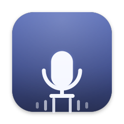

<div align="center">



# VoiceType

### Diktering på 33 språk. Ren text direkt. Allt på enheten.

En snabb, privat dikteringsapp med öppen källkod för macOS. Håll ned en tangent och
tala — på svenska, English, 中文, Español, 日本語, العربية, हिन्दी, Tiếng Việt eller
26 andra språk — så landar dina ord som ren, interpunkterad text i den app du just
använder.

Flerspråkig **hela vägen**: talmodellen matchas mot ditt språk, upprensningen kan
ditt språks interpunktion och utfyllnadsord, och appens eget gränssnitt finns på 16
språk. Allt detta körs **på enheten** — ditt ljud lämnar aldrig din Mac, oavsett
språk.

[](https://github.com/michael-L-i/VoiceType/releases/latest/download/VoiceType.dmg)

[](https://github.com/michael-L-i/VoiceType/releases/latest)
&nbsp;[](https://www.apple.com/macos/)
&nbsp;[](https://swift.org)
&nbsp;[](#privacy)
&nbsp;[](../LANGUAGES.md)
&nbsp;[](../LANGUAGES.md#interface-languages)
&nbsp;[](../../LICENSE)

[English](../../README.md) ·
[简体中文](./README.zh-Hans.md) ·
[Deutsch](./README.de.md) ·
[Español](./README.es.md) ·
[Français](./README.fr.md) ·
[Italiano](./README.it.md) ·
[日本語](./README.ja.md) ·
[한국어](./README.ko.md) ·
[Nederlands](./README.nl.md) ·
[Polski](./README.pl.md) ·
[Português](./README.pt-BR.md) ·
[Русский](./README.ru.md) ·
**Svenska** ·
[Türkçe](./README.tr.md) ·
[Українська](./README.uk.md) ·
[Tiếng Việt](./README.vi.md)

_Den här översättningen underhålls efter bästa förmåga — den engelska README-filen
är den auktoritativa versionen. Rättelser tas tacksamt emot via pull request, se
[bidragsguiden](../../CONTRIBUTING.md)._

</div>

---

> **Ledstjärna:** Tala var som helst, få ren text direkt, och ditt ljud lämnar
> aldrig din Mac.

## Varför VoiceType

- 🌍 **Flerspråkig hela vägen, inte engelska med undertexter.** Diktera på [33 språk](../LANGUAGES.md). VoiceType väljer en talmodell som verkligen stöder ditt språk, rensar upp enligt *det* språkets konventioner — helbredds interpunktion i 中文, uttalat 句号, språkspecifika utfyllnadsord — och levererar sitt eget gränssnitt på 16 språk.
- 🔒 **Privat på alla språk.** Ljud och transkriberingar stannar på din Mac. Inget konto, ingen telemetri, inget moln — det finns inte ens någon väg där «svåra språk skickas till en server» som du skulle behöva stänga av.
- ⚡ **Latens är funktionen.** Native Swift med talmodeller på enheten — vi optimerar tiden till text.
- 🎙️ **Tryck och tala var som helst.** Ett globalt kortkommando fungerar i alla appar; den uppstädade texten infogas precis där markören står.
- ✨ **Smart uppstädning.** Interpunktion, versalisering och borttagning av utfyllnadsord — utan att någonsin ändra dina ord.
- 📊 **Din röst, visualiserad.** En lugn hempanel följer dina ord, ditt tempo och dina dagssviter, med en fullständig aktivitetskarta och en vänlig användningssammanfattning på enheten — allt beräknat på din Mac.
- 🧩 **Utbytbara motorer.** Apples inbyggda modell som standard, med valfria lokala uppgraderingar — NVIDIA Parakeet, NVIDIA Nemotron, OpenAI Whisper — som du kan ladda ned och växla mellan (en aktiv i taget).

## Hämta och installera

1. **[⬇ Hämta VoiceType.dmg](https://github.com/michael-L-i/VoiceType/releases/latest/download/VoiceType.dmg)** från den senaste utgåvan.
2. Öppna DMG-filen och dra **VoiceType** till mappen **Program**. Appen är
   **signerad och notariserad av Apple**, så den startar med ett vanligt
   dubbelklick — ingen Gatekeeper-omväg behövs.
3. Ge de tre behörigheter som VoiceType ber om — **Mikrofon**,
   **Taligenkänning** och **Hjälpmedel** — så är du klar.

> Kräver **macOS 14** eller senare (Apple Silicon).

**Uppdateringar sker automatiskt.** VoiceType letar efter nya versioner i
bakgrunden (och på begäran via **Sök efter uppdateringar…**) och installerar dem
på plats med [Sparkle](https://sparkle-project.org) — varje uppdatering är
kryptografiskt signerad och verifierad. Ingen ny hämtning behövs. _(Automatisk
uppdatering fungerar från v0.1.1 och framåt; den allra första versionen, v0.1.0,
måste bytas ut för hand en gång.)_

## Så använder du den

Håll ned **höger alternativtangent (⌥)** var som helst och börja tala. En frostad
kapsel visas med en ljudvåg i realtid medan den lyssnar; släpp tangenten och din
uppstädade text infogas i appen som har fokus. Öppna fönstret när som helst för
att se din **hempanel** — ditt tempo, dina totaler, aktivitetskartan och var du
dikterar. Byt tangent, språk, motorer och uppstädning i **Inställningar**.

## Motorer

Allt körs på enheten. Apples modell är inbyggd i macOS och vald som standard; du
kan hämta andra lokala motorer från sidan **Modeller** i sidofältet och växla
mellan dem (en är aktiv åt gången).

| Motor | Språk | Anmärkningar |
| --- | --- | --- |
| **Apple Speech** (standard) | Varierar med macOS | Inbyggd, ingen nedladdning. `SpeechTranscriber` på macOS 26+, `SFSpeechRecognizer` på enheten i macOS 14–15 |
| **Parakeet TDT 0.6B V3** | **25** — endast europeiska | NVIDIA, via [FluidAudio](https://github.com/FluidInference/FluidAudio). Snabbast; ingen CJK |
| **Nemotron 3.5 ASR 0.6B** | **40 lokaler** inkl. CJK, arabiska, hindi | NVIDIA, via FluidAudio. Det flerspråkiga arbetsredskapet |
| **Whisper Base** | **99** | OpenAI, via [WhisperKit](https://github.com/argmaxinc/WhisperKit). Bredast täckning |

För upprensning är de inbyggda reglerna (omedelbara, deterministiska) standard;
Apple Intelligence (`FoundationModels`, macOS 26+) är en valfri uppgradering som
finns inbyggd i macOS utan något att ladda ned. Se
[**docs/LANGUAGES.md**](../LANGUAGES.md) för hela språk- och motormatrisen.

Hämtningsbara modeller laddas ned en gång vid behov (inget moln vid inferens —
ditt ljud lämnar fortfarande aldrig din Mac) och körs som CoreML på Apple Neural
Engine. VoiceType faller automatiskt tillbaka på en tillgänglig motor om ditt
val inte kan köras, och degraderar alltid till oformaterad text i stället för
att misslyckas.

> Talmodellen Parakeet är © NVIDIA, licensierad under
> [CC-BY-4.0](https://creativecommons.org/licenses/by/4.0/). FluidAudio är
> Apache-2.0. Whisper är OpenAI (MIT); WhisperKit är MIT.

<a name="languages"></a>
## Språk

De flesta dikteringsappar byggs för engelska och översätts efteråt. VoiceType
behandlar varje språk som ett förstklassigt fall — det är det vi bryr oss mest om
att få rätt.

**33 språk** för diktering · **16** med handskrivna upprensningsregler ·
**16** med översatt gränssnitt · **0** som kräver molnet.

Arabiska · Bulgariska · 简体中文 · Kroatiska · Tjeckiska · Danska · Nederlands ·
English · Estniska · Finska · Français · Deutsch · Grekiska · हिन्दी · Ungerska ·
Italiano · 日本語 · 한국어 · Lettiska · Litauiska · Maltesiska · Norsk · Polski ·
Português · Rumänska · Русский · Slovakiska · Slovenska · Español · Svenska ·
Türkçe · Українська · Tiếng Việt

Vad «flerspråkig» faktiskt betyder här:

- **Du väljer språket; VoiceType gissar aldrig.** Automatisk igenkänning producerar
  självsäkert nonsens när den har fel, så den erbjuds inte.
- **Motorerna matchas mot ditt språk.** Varje talmodell deklarerar vad den stöder
  (Parakeet är enbart europeisk; Nemotron täcker 40 lokaler inklusive kinesiska;
  Whisper täcker 99; Apples lista kommer från macOS). Modeller som inte klarar ditt
  språk gråmarkeras, och VoiceType växlar till en som klarar det.
- **Upprensningen kan språket.** 16 språk har ett litet, granskningsbart
  «språkpaket»: dess utfyllnadsord (嗯/呃, ähm, euh — aldrig ord som bär betydelse),
  dess interpunktionskonventioner (helbredds 。，？ för kinesiska och japanska, uttalat
  句号/読点 återgivet som tecken) och dess frågeheuristik. Övriga får trogen
  transkribering med neutral upprensning.
- **Gränssnittet är lokaliserat** till 16 språk och följer ditt macOS-systemspråk —
  oberoende av dikteringsspråket, så ett japanskt gränssnitt kan diktera portugisiska.
- **Utvalda, inte uppblåsta.** Vi skulle kunna lista Whispers 99 språk i morgon; vi
  erbjuder dem som en motor är genuint bra på, och ett test upprätthåller det.

📖 **[Fullständig språkmatris, kvalitetsnivåer och kända luckor →](../LANGUAGES.md)**

Saknas ditt språk, eller är en översättning fel? Att lägga till ett språk är medvetet
litet — en gränssnittsöversättning kräver ingen Swift alls — se
[docs/LOCALIZATION.md](../LOCALIZATION.md). Särskilt de maskinskrivna paketen behöver
ögon från modersmålstalare.

## Integritet

Ljud och transkript stannar på din Mac, punkt slut — det finns ingen molnväg.
Ingenting loggas utanför enheten, och ljud skrivs aldrig till disk. Till och med
den vänliga användningssammanfattningen byggs enbart av aggregerade räkningar —
aldrig din transkripttext. Det här är en konstitutionell invariant i projektet,
inte en inställning vi kanske ändrar senare.

## Bygg från källkod

```bash
swift test              # run the VoiceTypeKit unit tests
./Scripts/build-app.sh  # build VoiceType.app (ad-hoc signed)
./Scripts/make-dmg.sh   # package a drag-to-install VoiceType.dmg
open VoiceType.app
```

## Bidra

Bidrag är välkomna. Läs [bidragsguiden](../../CONTRIBUTING.md) för
utvecklingskrav, integritetsförväntningar och vägledning kring pull requests.
Vill du ha VoiceType på ditt språk? [docs/LOCALIZATION.md](../LOCALIZATION.md)
har checklistan — en gränssnittsöversättning kräver ingen Swift alls, och
dikteringskvalitet för ett nytt språk är en väldokumenterad fil.
Alla deltagare förväntas följa [uppförandekoden](../../CODE_OF_CONDUCT.md).
För sårbarheter, följ den privata rapporteringsprocessen i vår
[säkerhetspolicy](../../SECURITY.md).

## Arkitektur

Native **Swift 6 / SwiftUI**-app i Dock (macOS 14) med en hempanel. Globalt
tryck-och-tala-kortkommando · mikrofonupptagning med AVAudioEngine · utbytbar
transkribering på enheten · utbytbar uppstädning · textinfogning via
inklistring/Hjälpmedel · en svävande inspelnings-HUD. Kärnan (`VoiceTypeKit`) är
ren och enhetstestad; appmålet innehåller systemmotorerna och gränssnittet.
Detaljerna finns i [`CLAUDE.md`](../../CLAUDE.md) och utvecklas via `specs/`.

## Licens

[MIT](../../LICENSE) © 2026 Michael Li.

Tredjepartskomponenter och modeller på enheten som medföljer appen behåller sina
egna licenser — se [`THIRD_PARTY_LICENSES.md`](../../THIRD_PARTY_LICENSES.md)
(finns även inuti apppaketet).

## Så drivs det här repot

VoiceType är ett fristående produktrepo som sköts dagligen av en agent (den
**yttre loopen**: sortera → granska → slå ihop/eskalera), där en människa står
för **smaken** genom att redigera `specs/`. Det länkar ramverket
[`@aros/*`](../../../agent-repo-os) under lokal utveckling. Se
[`CLAUDE.md`](../../CLAUDE.md) för spelreglerna.

## Repostruktur

```
VoiceType/
├── CLAUDE.md          # spelregler för agenten
├── Package.swift      # SwiftPM: VoiceTypeKit (kärna) + VoiceType (app)
├── Sources/
│   ├── VoiceTypeKit/  # ren, testad kärna: protokoll, pipeline, uppstädning, resolver
│   └── VoiceType/     # app: kortkommando, ljud, motorer, infogning, panelgränssnitt
├── Tests/             # enhetstester för VoiceTypeKit
├── Scripts/           # build-app.sh · make-dmg.sh · make-icon.swift · release.sh
├── Resources/         # Info.plist · entitlements · AppIcon
├── docs/              # LANGUAGES.md (täckningsmatris) · LOCALIZATION.md · readme/
├── specs/             # människans yta — produktriktning (agenten redigerar inte)
└── README.md
```
